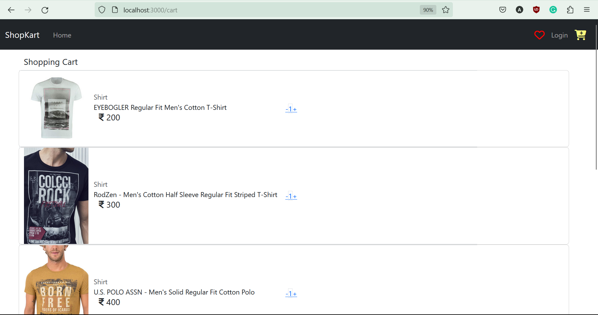

# Ecommerce (React) Coding Assessment

## Overview

To complete this assessment, you will need to use this [Ecommerce-boilerplate](https://github.com/gurukishore111/Ecommerce-boilerplate) web app.

The purpose of this assessment is to assess your **skills and approach to composing a simple web app** given an API feed.

## What to do?

Your goal is to implement an eCommerce application. The CSS framework/library is totally up to you.

Although it's a very basic exercise, we will be looking for simple, well-designed, well-commented, and tested code in the submission.

Please include a `README` with setup instructions and any other documentation you created as part of your solution.

Also, add very short info for the following to your `README`:

- Describe all the application functionalities
- Are there any improvements you could make to your submission?
- What would you do differently if you were allocated more time?

Once you complete implementation, please add the link to the hosted repository (e.g. Github). Alternatively, you may submit your code as a ZIP file too.

(NOTE: You have to use the latest version of v18 and react-router-dom v6)

## How should the application work?

The user of this react application should be able to view all the products. The application should have the following workflow,

1. Create the login/register functionality.
2. Once the user is authenticated
3. Users can add the products to the cart page
4. Also user can add their favourite products

## Development Setup

- Clone this repo
- `npm install` - To install the dependencies
- `npm run server` - To start the JSON server
- `npm start` - To start the react app

## This project's user interface should like this.

## API Usage

API can be launched using npm run server.
| Endpoint | Result |
|------------------------------|-----------------------------------------------------|
| /users | Lists all available users |
| /products | Lists all available products |
| /orders | Lists all available orders  
| /favourites | Lists all available favourites

Refer - [JSON sever](https://www.npmjs.com/package/json-server) docs for more information

## Bonus

- Feel free to add functionality (not mandatory)
- Use redux/context for state management
- Well explained readme (screenshot etc)

---
## My Project's user interface.

### Login/Register page

### Home page

### Cart page

## API Usage & Functionalities

- While registering a user I have stored that user in the db.json through a POST request to "http://localhost:5000/users"

- Then In Login page I have validated the user through mailId and Password by GET request to "http://localhost:5000/users"

- to get the user in login while validating Context API has been used to send the Users obj , userContext.js

- Fetched all the products data from the db.json and show them in card format  

- when add to cart is clicked in the product list that item will go to cart page for which I have used Context API. Created productContext.js and ProductState.js

## What would you do differently if you were allocated more time?

- I would improve the UI which i could'nt do because of limited time
- cart fuctionalities and pricing
- rating a product
- move from wishlist item to cart items
- reviws of customers. 

